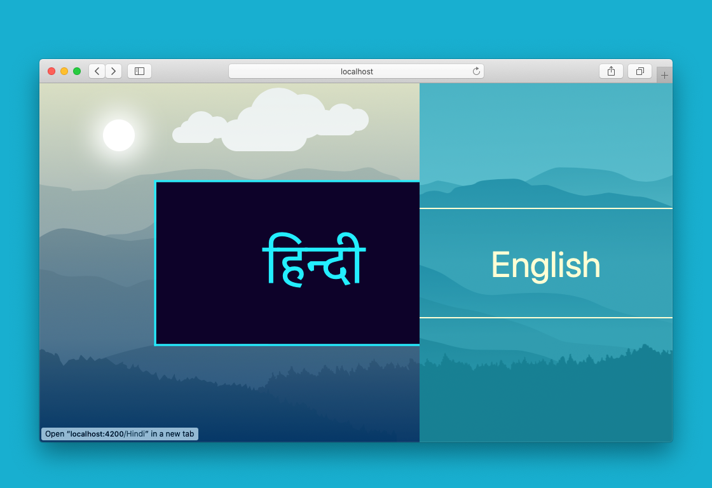
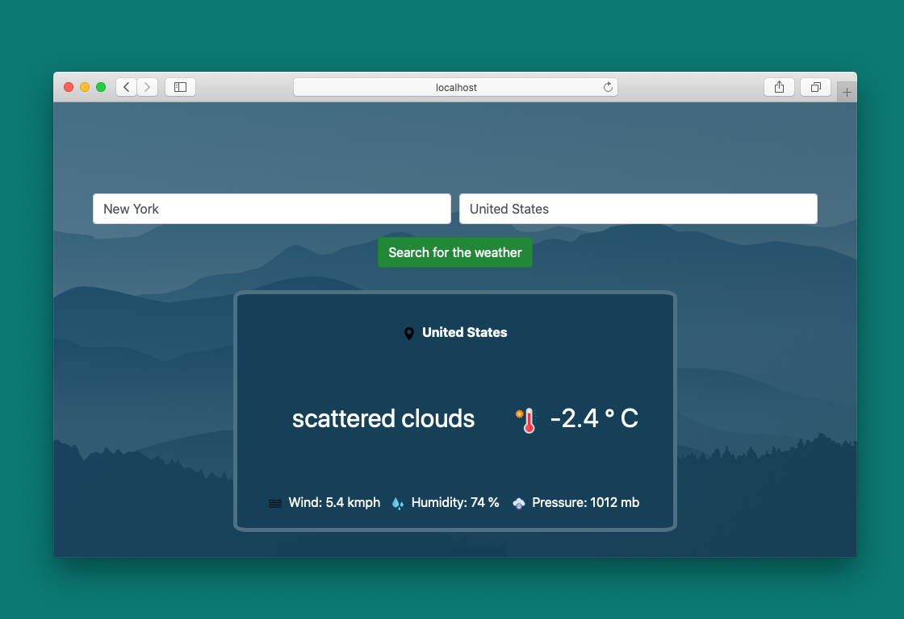

# Mausam Vibhaag (मौसम विभाग)
सबसे अच्छा मौसम पूर्वानुमान प्राप्त करें
*en: Get the most accurate weather*

## Getting Started

The app is based on Angular

### Installing

Clone the repo

```
$ ng serve -o
```

If you don't have Angular installed
*Install it using npm*

```
$ npm install -g @angular/cli
```

## Screenshots





## Built With

* [Angular](https://angular.io/) - The web framework used for development of Front end applications.

## Authors

* **Pulkit Banta** - *Initial work* - [PulkitBanta](https://github.com/PulkitBanta/)
* **Nischey Badyal** - *Designing* - [NB134](https://github.com/NB134)

