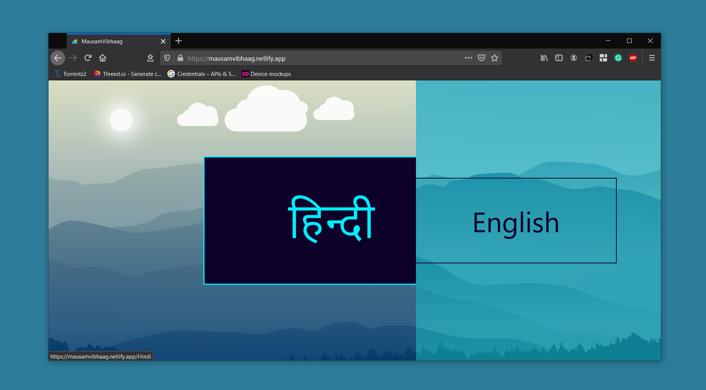
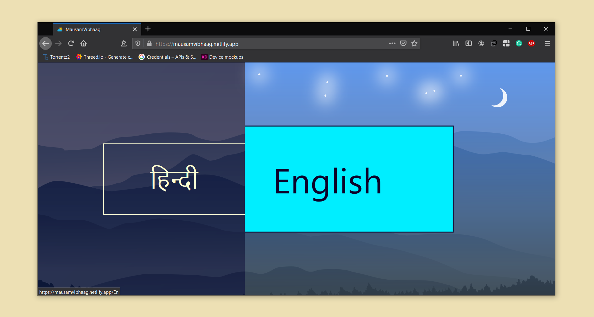
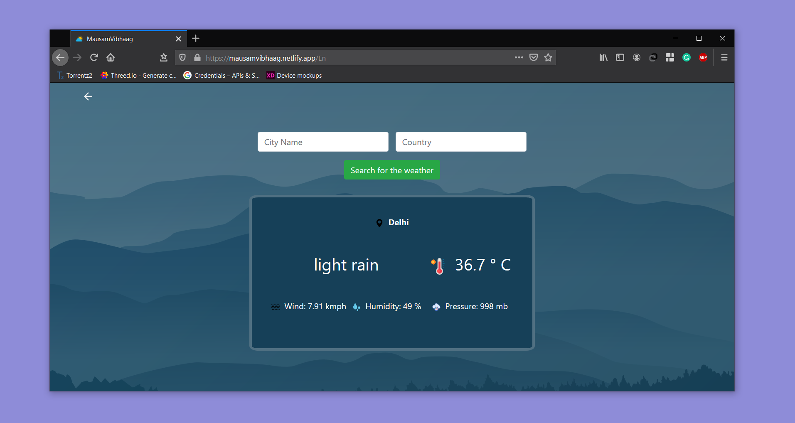
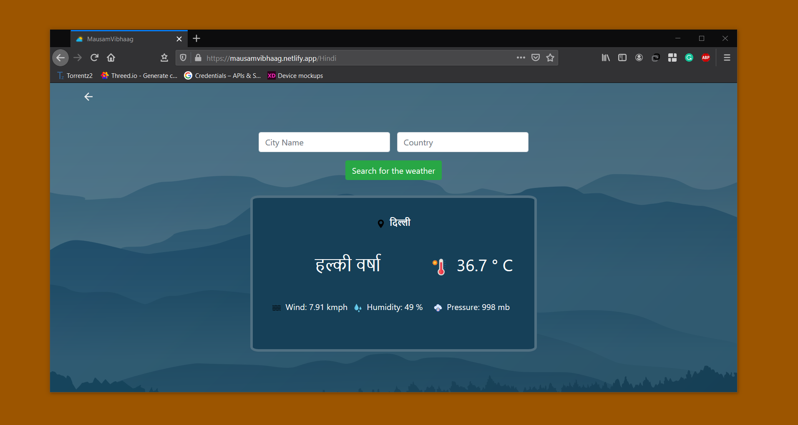

# Mausam Vibhaag (मौसम विभाग)
सबसे अच्छा मौसम पूर्वानुमान प्राप्त करें

*En: Get the most accurate weather*

A weather application that provides precise weather according to the location given by the user.
The weather can be displayed either in English or Hindi.

## Getting Started

These instructions will get you a copy of the project up and running on your local machine for development and testing purposes.

You'll need [Git](https://git-scm.com) and [Node.js](https://nodejs.org/en/download/)

```
node@v10.16.0 or higher
npm@6.9.0 or higher
git@2.17.1 or higher
```

## How To Use

From your command line, clone and run Mausam-Vibhaag:

```bash
# Clone this repository
$ git clone https://github.com/PulkitBanta/Mausam-Vibhaag.git


# Go into the repository
$ cd Mausam-Vibhaag

# Install dependencies
$ npm install
```

### Getting your API key
Get API key from [OpenWeather](https://openweathermap.org/current) and replace `"Your API KEY"` in the `api.service.ts` with the api_key received from [OpenWeather](https://openweathermap.org/current).

```bash
#Start's development server
$ npm start
```

## Screenshots






## Contributing

Please read [CONTRIBUTING.md](CONTRIBUTING.md) for details on code of conduct, and the process for submitting pull requests.

## Built With

* [Angular](https://angular.io/) - The web framework used for the development of Front end applications.
* [OpenWeather](https://openweathermap.org/) - More weather in your city

## Contributors

| [](https://github.com/PulkitBanta) | [](https://github.com/NB134) | [](https://github.com/abhishekashyap) |
| --- | --- | --- |
| [Pulkit Banta](https://github.com/PulkitBanta) | [Nischey Badyal](https://github.com/NB134) | [Abhishek Kashyap](https://github.com/Abhishekashyap)
| <p align="center"><a title="code">💻</a> <a title="designing">🎨</a> <a title="documentation">📖</a></p> | <p align="center"><a title="designing">🎨</a></p> | <p align="center"><a title="documentation">📖</a></p> |

## License

This project is licensed under the MIT License - see the [LICENSE](LICENSE) file for details